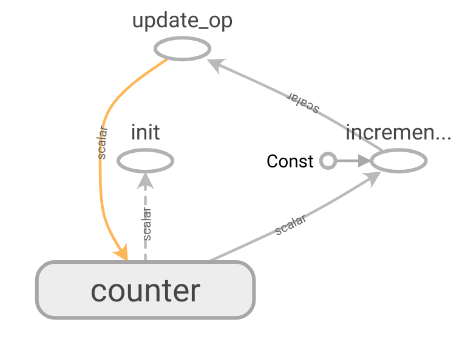

---

layout: yandex2

style: |
    /* собственные стили можно писать здесь!! */


---

# {:.logo}

## {{ site.presentation.title }}
{:.title}

### {{ site.presentation.service }}



{:.nda}


<div class="authors">

<p>{{ site.author.name }}, {{ site.author.position }}</p>



<p>{{ site.author2.name }}, {{ site.author2.position }}</p>


</div>

## Tensorflow и другие

{:.fullscrean}


## Tensorflow vs two


{:.image-left}

1. Развитый проект
2. Дополняющие проекты
3. Хорошая документация
4. Отличный код

## Основы Tensorflow
{:.section}

## Tensorflow -- это просто


{:.image-left}

**Собрать граф**

```python
x = tf.placeholder(tf.float32)
y = tf.placeholder(tf.float32)
z = (x * y) + (x + y)
```

## Tensorflow -- это просто


{:.image-left}


Собрать граф

```python
x = tf.placeholder(tf.float32)
y = tf.placeholder(tf.float32)
z = (x * y) + (x + y)
```


**Использовать его**

```python
with tf.Session() as sess:
    sess.run(z, feed_dict={x: 1, y: -2})
    # -3
```

## Чуть сложнее
### Tensorflow -- это просто


{:.icon-left}

Как сделать счетчик?

```python
counter = tf.Variable(0)
```

## Чуть сложнее
### Tensorflow -- это просто


{:.image-left}

Как сделать счетчик?

```python
counter = tf.Variable(0)
incremented = counter + 1

# state <- new_value
update_op = tf.assign(counter, incremented)
```


## From Keras to Tensorflow
{:.section}

## From Keras

```python
model = Sequential()
model.add(Dense(units=64, activation='relu', input_dim=100))
model.add(Dense(units=10, activation='softmax'))
model.compile(loss='categorical_crossentropy',
              optimizer='sgd',
              metrics=['accuracy'])
model.fit(x_train, y_train, epochs=5, batch_size=32)
loss_and_metrics = model.evaluate(x_test, y_test, batch_size=128)
```

## Model
### to Tensorflow


```python
def very_model(x):
    # body:
    x = layers.conv2d(x, 32, 3, 2)
    <...>
    x = layers.conv2d(x, 2048, 1, 1)
    gap = tf.reduce_mean(x, [1, 2])
    # head:
    return layers.fully_connected(gap, 1000, activation_fn=None) 
```

## Model (+bn + dropout)
### to Tensorflow

```python
def very_model(x):
    # body:
    x = layers.conv2d(x, 32, 3, 2, normalizer_fn=layers.batch_norm)
    <...>
    x = layers.conv2d(x, 2048, 1, 1, normalizer_fn=layers.batch_norm)
    gap = tf.reduce_mean(x, [1, 2])
    # head:
    gap = tf.nn.dropout(gap, 0.5)
    return layers.fully_connected(gap, 1000, activation_fn=None) 
```


## Train op
### to Tensorflow


```python
loss = tf.reduce_mean(
        tf.nn.sparse_softmax_cross_entropy_with_logits(
            labels=labels,
            logits=logits,
    ))

optimizer = tf.train.GradientDescentOptimizer(lr)
train_op = optimizer.minimize(loss)
```

## Train loop
### to Tensorflow

```python
with tf.Session() as sess:
    sess.run(init_op)
    for x, y in X, Y:
        x = preprocess(x)
        sess.run(train_op, feed_dict={images: x, labels: y})
    val = []
    for x, y in vX,  vY:
        x = preprocess(x)
        metric = sess.run(metrics_op, feed_dict={images: x, labels: y})
```

## Подводные камни
### to Tensorflow

1. Model state
2. Train loop
3. Train op

**Note: when training, the moving_mean and moving_variance need to be updated.**

```python
update_ops = tf.get_collection(tf.GraphKeys.UPDATE_OPS)
    with tf.control_dependencies(update_ops):
train_op = optimizer.minimize(loss)
```

## to Tensorflow
### Хорошие практики

0. Читать документацию и экспериментировать
1. Использовать `tf.train.MonitoredTrainingSession` вместо `Session`
2. Посмотреть реализацию `tf.contrib.layers.optimize_loss`

## Dataset API
{:.section}

## Работа с данными
### Dataset API

1. Список семплов (картинок, файлов, строчек, ....)
2. Загрузка
3. Предобработка
4. Аугментация
5. Асинхронная подгрузка

## Итерирование по семплам
### Dataset API

**from_generator**

```python
def gen():
    for path, label in df:
        yield {'path': path, 'label': label}


ds = tf.data.Dataset.from_generator(gen, {'path': tf.string, 'label': tf.int64})
value = ds.make_one_shot_iterator().get_next()

with tf.Session() as sess:
    while True:
        print(sess.run(value))
```

## Преобразование данных
### Dataset API

**map**

```
def read_image(sample):
    path = sample['path']
    bin = tf.read_file(path)
    image = tf.image.decode_jpeg(bin)
    return {'image': image, "label": sample['label']}


ds = ds.map(read_image, num_parallel_calls=8)
```

## Пакетные операции
### Dataset API

```python
ds.shuffle(buffer)
ds.repeat()
ds.batch(batch_size)
ds.prefetch(buffer)
```

## Итераторы
### Dataset API

1. One-shot
2. Initializable
3. Reinitializable
4. Feedable

## Estimator API
{:.section}

## Wishlist
### Estimator API

1. Несколько версий графа (train, eval, inference)
2. Сохранение и продолжение тренировки
3. Корректное сохранение логов для tensorboard
4. Модульность кода и простые интерфейсы
5. Простой экспорт модели

## Estimator API
### Estimator API. Пример

```python
model = tf.estimator.Estimator(
    model_fn=model_fn,
    model_dir=model_dir,
    config=run_config,
    params=params)

model.train(train_generator)
model.evaluate(val_generator)
```


## model_fn

Нужно всего лишь заполнить словарь `tf.estimator.EstimatorSpec`

```
train_specs = dict(
    mode=mode,
    loss=loss,
    train_op=<...>,
)
```

```
eval_specs = dict(
    mode=mode,
    loss=loss,
    eval_metric_ops={<...>}
)
```


## Как обрести уверенность в результатах

1. Разобраться в матчасти
2. Читать документацию
3. Читать исходники tensorflow и tensorflow/models
4. Использовать Dataset API
5. Переходить на Estimator API/MonitoredTrainingSession


## Контакты 
{:.contacts}



<figure markdown="1">

### {{ site.author.name }}


{{ site.author.position }}


</figure>





<figure markdown="1">

### {{ site.author2.name }}


{{ site.author2.position }}


</figure>



<!-- разделитель контактов -->
-------

<!-- left -->
- {:.mail}m12sl@yandex-team.ru
- {:.github}m12sl

<!-- right -->
- {:.telegram}m12sl
- {:.vk}@m12sl

<!-- 

- {:.mail}author@yandex-team.ru
- {:.phone}+7-999-888-7766
- {:.github}author
- {:.bitbucket}author
- {:.twitter}@author

- {:.skype}author
- {:.instagram}author
- {:.facebook}author
- {:.ok}@author

-->
