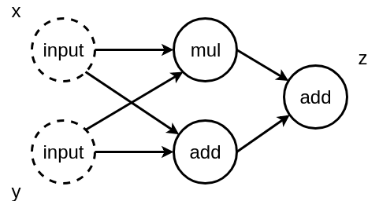

---

layout: yandex2

style: |
    /* собственные стили можно писать здесь!! */


---

# {:.logo}

## {{ site.presentation.title }}
{:.title}

### {{ site.presentation.service }}



{:.nda}


<div class="authors">

<p>{{ site.author.name }}, {{ site.author.position }}</p>



<p>{{ site.author2.name }}, {{ site.author2.position }}</p>


</div>

## Tensorflow и другие

{:.fullscrean}


## Tensorflow vs all


{:.image-left}

1. Развитый проект
2. Дополняющие проекты
3. Хорошая документация
4. Отличный код

## Основы Tensorflow
{:.section}

## Tensorflow -- это просто


{:.image-left}

**Собрать граф**

```python
x = tf.placeholder(tf.float32)
y = tf.placeholder(tf.float32)
z = (x * y) + (x + y)
```

## Tensorflow -- это просто


{:.image-left}


Собрать граф

```python
x = tf.placeholder(tf.float32)
y = tf.placeholder(tf.float32)
z = (x * y) + (x + y)
```


**Использовать его**

```python
with tf.Session() as sess:
    sess.run(z, feed_dict={x: 1, y: -2})
    # -3
```

## Tensorflow -- это просто
### Чуть сложнее


{:.icon-left}

Как сделать счетчик?

```python
counter = tf.Variable(0)
```

## Tensorflow -- это просто
### Чуть сложнее


{:.image-left}

Как сделать счетчик?

```python
counter = tf.Variable(0)
incremented = counter + 1

# state <- new_value
update_op = tf.assign(counter, incremented)
```


## From Keras to Tensorflow
{:.section}

## From Keras

```python
model = Sequential()
model.add(Dense(units=64, activation='relu', input_dim=100))
model.add(Dense(units=10, activation='softmax'))
model.compile(loss='categorical_crossentropy',
              optimizer='sgd',
              metrics=['accuracy'])
model.fit(x_train, y_train, epochs=5, batch_size=32)
loss_and_metrics = model.evaluate(x_test, y_test, batch_size=128)
```


## to Tensorflow
### Tensorflow model

```python
def very_model(x):
    # body:
    x = layers.conv2d(x, 32, 3, 2)
    ...
    x = layers.conv2d(x, 2048, 1, 1)
    gap = tf.reduce_mean(x, [1, 2])
    # head:
    return layers.fully_connected(gap, 1000, activation_fn=None) 
```

## to Tensorflow
### Tensorflow model (+bn + dropout)

```python
def very_model(x):
    # body:
    x = layers.conv2d(x, 32, 3, 2, normalizer_fn=layers.batch_norm)
    ...
    x = layers.conv2d(x, 2048, 1, 1, normalizer_fn=layers.batch_norm)
    gap = tf.reduce_mean(x, [1, 2])
    # head:
    gap = tf.nn.dropout(gap, 0.5)
    return layers.fully_connected(gap, 1000, activation_fn=None) 
```


## to Tensorflow
### Tensorflow train_op

```python
loss = tf.reduce_mean(
        tf.nn.sparse_softmax_cross_entropy_with_logits(
            labels=labels,
            logits=logits,
    ))

optimizer = tf.train.GradientDescentOptimizer(lr)
train_op = optimizer.minimize(loss)
```

## to Tensorflow
### Tensorflow train loop

```python
with tf.Session() as sess:
    sess.run(init_op)
    for x, y in X, Y:
        x = preprocess(x)
        sess.run(train_op, feed_dict={images: x, labels: y})
    val = []
    for x, y in vX,  vY:
        x = preprocess(x)
        metric = sess.run(metrics_op, feed_dict={images: x, labels: y})
```

## to Tensorflow
### Подводные камни

1. Model state
2. Train loop
3. Train op

**Note: when training, the moving_mean and moving_variance need to be updated.**

```python
update_ops = tf.get_collection(tf.GraphKeys.UPDATE_OPS)
    with tf.control_dependencies(update_ops):
train_op = optimizer.minimize(loss)
```

## to Tensorflow
### Хорошие практики

0. Читать документацию и экспериментировать
1. Использовать `tf.train.MonitoredTrainingSession` вместо `Session`
2. Посмотреть реализацию `tf.contrib.layers.optimize_loss`

## Dataset API
{:.section}

## Работа с данными
### Dataset API

1. Список семплов (картинок, файлов, строчек, ....)
2. Загрузка
3. Предобработка
4. Аугментация
5. Асинхронная подгрузка

## Работа с данными
### Dataset API

```python
from_generator
map()
shuffle
repeat
batch
```


## Estimator API
{:.section}

## Wishlist
### Estimator API

1. Несколько версий графа (train, eval, inference)
2. Сохранение и продолжение тренировки
3. Корректное сохранение логов для tensorboard
4. Модульность кода и простые интерфейсы
5. Простой экспорт модели

## Estimator API
### Estimator API. Пример

```python
model = tf.estimator.Estimator(
    model_fn=model_fn,
    model_dir=model_dir,
    config=run_config,
    params=params)

model.train(train_generator)
model.evaluate(val_generator)
```


## Как обрести уверенность в результатах

1. Разобраться в матчасти
2. Читать документацию
3. Читать исходники tensorflow и tensorflow/models
4. Использовать Dataset API
5. Переходить на Estimator API/MonitoredTrainingSession


## Название раздела
{:.section}

### Верхний колонтитул

## Длинная цитата переносится на несколько строк
{:.blockquote}

### Источник

## Заголовок

Основной текст

**Ключевая мысль**

- Маркированный список
- Маркированный список

1. Нумерованный список
2. Нумерованный список

### Источник

## Заголовок

Элементы появляются по очереди

1. {:.next}Нумерованный список
2. {:.next}Нумерованный список
3. {:.next}Нумерованный список
4. {:.next}Нумерованный список


### Источник

## Заголовок
{:.images}


### Источник

## Заголовок
{:.images .two}


*Текст*


*Текст*

### Источник

## Заголовок
{:.images .three}


*Текст*


*Текст*


*Текст*

### Источник

## Заголовок


{:.image-right}

Основной текст

**Ключевая мысль**

- Маркированный список
- Маркированный список

1. Нумерованный список
2. Нумерованный список

### Источник

## Заголовок

<!-- библиотека пиктограмм https://patterns.yandex-team.ru/presentations?typeIn=icons -->


{:.icon-left}

Основной текст

**Ключевая мысль**

- Маркированный список
- Маркированный список

1. Нумерованный список
2. Нумерованный список

### Источник

## Заголовок
{:.icons}

<!-- библиотека пиктограмм https://patterns.yandex-team.ru/presentations?typeIn=icons -->


*Текст*


*Текст*


*Текст*

### Источник

## Заголовок
{:.icons .four}

<!-- библиотека пиктограмм https://patterns.yandex-team.ru/presentations?typeIn=icons -->


*Текст*


*Текст*


*Текст*


*Текст*

### Источник

## Заголовок
{:.icons .five}

<!-- библиотека пиктограмм https://patterns.yandex-team.ru/presentations?typeIn=icons -->


*Текст*


*Текст*


*Текст*


*Текст*


*Текст*

### Источник

## Заголовок будет скрыт
{:.fullscreen}


## Заголовок будет скрыт
{:.fullscreen}


<figure markdown="1">
Текст
</figure>

## Таблица

|  Locavore     |  Umami       |  Helvetica |  Vegan     |
+---------------|--------------|------------|------------+
|  Fingerstache<br/>The second line |  Kale        |  Chips     |  Keytar    |
|  Sriracha     |  Gluten-free |  Ennui     |  Keffiyeh  |
|  Thundercats  |  Jean        |  Shorts    |  Biodiesel |
|* Terry        |* Richardson  |* Swag      |* Blog      |

Текст

### Источник

## Исходный код (html)

```html
<!DOCTYPE html>
<html lang="en">
<head>
    <title>Shower</title> <!--Comment-->
    <link rel="stylesheet" href="screen.css">
</head>
<body>Hello!</body>
</html>
```

## Исходный код (js)

Пояснение для кода.

```js
var i, j, over, data = new Array(2, 34.12, 4.7, 0, 234, 5);
var test = false;

for (i = 1; i < data.length; i++) {
    over = data[i]; 
    for (j = i - 1; j >= 0 && data[j] > over; j--) {
        data[j + 1] = data[j];
    }
    data[j + 1] = over;
}
alert(data.join(','));
```

## Исходный код (css)

```css
.head {
    background-color: yellow;
}

.head__logo {
    background-image: url(images/logo.svg);
}

#test, body {
    font-weight: bold;
}

```

## Этот заголовок будет скрыт
{:.fullscreen}

```js
// исходный код (на весь экран)

var x = 10;
for (var i = 0; i < x; i++) {
    console.log('hello!');
}
```

## Контакты 
{:.contacts}



<figure markdown="1">

### {{ site.author.name }}


{{ site.author.position }}


</figure>





<figure markdown="1">

### {{ site.author2.name }}


{{ site.author2.position }}


</figure>



<!-- разделитель контактов -->
-------

<!-- left -->
- {:.mail}m12sl@yandex-team.ru
- {:.github}m12sl

<!-- right -->
- {:.telegram}m12sl
- {:.vk}@m12sl

<!-- 

- {:.mail}author@yandex-team.ru
- {:.phone}+7-999-888-7766
- {:.github}author
- {:.bitbucket}author
- {:.twitter}@author

- {:.skype}author
- {:.instagram}author
- {:.facebook}author
- {:.ok}@author

-->
